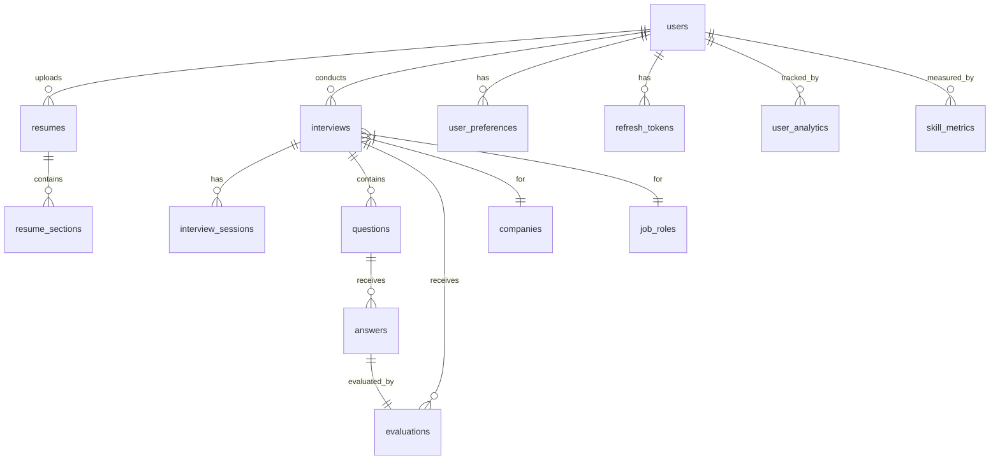

# Software Architecture Document - InterviAI Backend

## Table of Contents
1. [Executive Summary](#executive-summary)
2. [System Overview](#system-overview)
3. [Architecture Overview](#architecture-overview)
4. [Module Design](#module-design)
5. [Database Design](#database-design)
6. [API Design](#api-design)
7. [Security Architecture](#security-architecture)
8. [AI Integration Module](#ai-integration-module)
9. [File Storage Strategy](#file-storage-strategy)
10. [Interview Engine Design](#interview-engine-design)
11. [Dashboard & Analytics](#dashboard--analytics)
12. [Project Structure](#project-structure)
13. [Design Patterns](#design-patterns)
14. [Implementation Roadmap](#implementation-roadmap)
15. [Coding Standards](#coding-standards)

---

## Executive Summary

InterviAI is an enterprise-grade AI-powered interview preparation platform designed as a modular monolith using Spring Boot 3 and Java 21. The architecture emphasizes scalability, maintainability, and future-proof design patterns that allow modules to evolve into microservices when needed.

### Key Architectural Decisions
- **Modular Monolith**: Enables faster initial development while maintaining clear boundaries for future service extraction
- **Clean Architecture**: Ensures separation of concerns and testability
- **Domain-Driven Design**: Provides clear business logic encapsulation
- **PostgreSQL**: Robust, ACID-compliant database with excellent JSON support for AI responses
- **JWT Authentication**: Stateless, scalable authentication mechanism

---

## System Overview

### High-Level Architecture

```
┌─────────────────────────────────────────────────────────────┐
│                    Frontend (React/TypeScript)               │
└────────────────────────────┬────────────────────────────────┘
                             │ HTTPS
┌────────────────────────────┴────────────────────────────────┐
│                    API Gateway / Load Balancer               │
└────────────────────────────┬────────────────────────────────┘
                             │
┌────────────────────────────┴────────────────────────────────┐
│                    Spring Boot Application                   │
│  ┌────────────────────────────────────────────────────┐    │
│  │              Presentation Layer (REST)              │    │
│  └────────────────────────┬───────────────────────────┘    │
│  ┌────────────────────────┴───────────────────────────┐    │
│  │               Business Logic Layer                  │    │
│  └────────────────────────┬───────────────────────────┘    │
│  ┌────────────────────────┴───────────────────────────┐    │
│  │              Persistence Layer (JPA)                │    │
│  └────────────────────────┬───────────────────────────┘    │
└────────────────────────────┴────────────────────────────────┘
                             │
         ┌───────────────────┴───────────────────┐
         │                                       │
┌────────┴────────┐                   ┌─────────┴────────┐
│   PostgreSQL    │                   │  Google Gemini   │
└─────────────────┘                   └──────────────────┘
```

### Core Principles
1. **Separation of Concerns**: Each layer has distinct responsibilities
2. **Dependency Inversion**: Dependencies point inward toward the domain
3. **Interface Segregation**: Modules communicate through well-defined interfaces
4. **Single Responsibility**: Each class has one reason to change

---

## Architecture Overview

### Layered Architecture

#### 1. Presentation Layer
- **Purpose**: Handle HTTP requests/responses, input validation, API documentation
- **Components**: Controllers, Request/Response DTOs, Exception Handlers
- **Dependencies**: Business Layer interfaces only

#### 2. Business Layer
- **Purpose**: Core business logic, orchestration, domain rules
- **Components**: Services, Domain Models, Business Rules, Use Cases
- **Dependencies**: Domain interfaces, no direct infrastructure dependencies

#### 3. Persistence Layer
- **Purpose**: Data access, ORM mapping, query optimization
- **Components**: Repositories, Entities, Specifications
- **Dependencies**: Database, JPA

#### 4. Infrastructure Layer
- **Purpose**: External integrations, file storage, AI services
- **Components**: API Clients, File Handlers, Email Services
- **Dependencies**: External APIs, File System

#### 5. Configuration Layer
- **Purpose**: Application configuration, bean definitions, profiles
- **Components**: Config Classes, Properties, Profiles
- **Dependencies**: Spring Framework

#### 6. Cross-Cutting Concerns
- **Security**: Authentication, Authorization, Encryption
- **Exception Handling**: Global exception handling, error responses
- **Logging**: Structured logging, audit trails
- **Validation**: Input validation, business rule validation

---

## Module Design

### Module Architecture Pattern

Each module follows this structure:
```
module/
├── controller/
├── service/
│   ├── impl/
│   └── interfaces/
├── repository/
├── entity/
├── dto/
│   ├── request/
│   └── response/
├── mapper/
├── validator/
├── exception/
└── config/
```

### 1. Authentication Module

#### Purpose
Handle user authentication, JWT token generation/validation, and session management.

#### Responsibilities
- User login/logout
- JWT token generation and validation
- Refresh token management
- Password reset functionality
- Account activation

#### Components

**Controllers**
- `AuthenticationController`: Login, logout, refresh token endpoints
- `PasswordResetController`: Password reset flow

**Services**
- `AuthenticationService`: Authentication logic
- `JwtService`: JWT token operations
- `RefreshTokenService`: Refresh token management

**Repositories**
- `RefreshTokenRepository`: Refresh token persistence

**Entities**
- `RefreshToken`: Stores refresh tokens

**DTOs**
- Request: `LoginRequest`, `RefreshTokenRequest`, `PasswordResetRequest`
- Response: `AuthenticationResponse`, `TokenRefreshResponse`

**Configuration**
- `JwtConfiguration`: JWT properties
- `SecurityConfiguration`: Security filters

**API Endpoints**
| Method | Endpoint | Description |
|--------|----------|-------------|
| POST | /api/v1/auth/login | User login |
| POST | /api/v1/auth/logout | User logout |
| POST | /api/v1/auth/refresh | Refresh access token |
| POST | /api/v1/auth/forgot-password | Initiate password reset |
| POST | /api/v1/auth/reset-password | Complete password reset |

**Future Improvements**
- Multi-factor authentication
- OAuth2 integration
- Biometric authentication support

### 2. User Module

#### Purpose
Manage user accounts, profiles, and preferences.

#### Responsibilities
- User registration
- Profile management
- Account settings
- User preferences

#### Components

**Controllers**
- `UserController`: User CRUD operations
- `RegistrationController`: User registration

**Services**
- `UserService`: User management logic
- `RegistrationService`: Registration workflow

**Repositories**
- `UserRepository`: User persistence

**Entities**
- `User`: Core user entity
- `UserPreferences`: User settings

**DTOs**
- Request: `UserRegistrationRequest`, `UserUpdateRequest`
- Response: `UserResponse`, `UserProfileResponse`

**API Endpoints**
| Method | Endpoint | Description |
|--------|----------|-------------|
| POST | /api/v1/users/register | User registration |
| GET | /api/v1/users/profile | Get user profile |
| PUT | /api/v1/users/profile | Update user profile |
| DELETE | /api/v1/users/{id} | Delete user account |

### 3. Resume Module

#### Purpose
Handle resume upload, parsing, and content extraction.

#### Responsibilities
- Resume file upload
- PDF parsing and text extraction
- Resume content storage
- Resume analysis

#### Components

**Controllers**
- `ResumeController`: Resume upload and retrieval

**Services**
- `ResumeService`: Resume processing logic
- `ResumeParserService`: PDF parsing implementation
- `ResumeStorageService`: File storage handling

**Repositories**
- `ResumeRepository`: Resume metadata persistence

**Entities**
- `Resume`: Resume metadata and parsed content
- `ResumeSection`: Structured resume sections

**DTOs**
- Request: `ResumeUploadRequest`
- Response: `ResumeResponse`, `ParsedResumeResponse`

**API Endpoints**
| Method | Endpoint | Description |
|--------|----------|-------------|
| POST | /api/v1/resumes/upload | Upload resume |
| GET | /api/v1/resumes/{id} | Get resume details |
| DELETE | /api/v1/resumes/{id} | Delete resume |
| GET | /api/v1/resumes/user/{userId} | Get user's resumes |

### 4. Interview Module

#### Purpose
Core interview functionality including session management and workflow orchestration.

#### Responsibilities
- Interview session creation and management
- Interview configuration
- Interview state management
- Interview completion

#### Components

**Controllers**
- `InterviewController`: Interview operations

**Services**
- `InterviewService`: Interview orchestration
- `InterviewSessionService`: Session management
- `InterviewStateService`: State transitions

**Repositories**
- `InterviewRepository`: Interview persistence
- `InterviewSessionRepository`: Session persistence

**Entities**
- `Interview`: Interview configuration and metadata
- `InterviewSession`: Active interview session
- `InterviewState`: Interview state machine

**DTOs**
- Request: `CreateInterviewRequest`, `UpdateInterviewStateRequest`
- Response: `InterviewResponse`, `InterviewSessionResponse`

### 5. Question Module

#### Purpose
Manage interview questions generation and retrieval.

#### Responsibilities
- Question generation via AI
- Question categorization
- Question difficulty levels
- Question bank management

#### Components

**Controllers**
- `QuestionController`: Question operations

**Services**
- `QuestionService`: Question management
- `QuestionGenerationService`: AI-powered generation

**Repositories**
- `QuestionRepository`: Question persistence

**Entities**
- `Question`: Interview question
- `QuestionCategory`: Question categorization

### 6. Answer Module

#### Purpose
Handle user answer submission and storage.

#### Responsibilities
- Answer submission
- Answer validation
- Answer history
- Audio/text answer support

#### Components

**Controllers**
- `AnswerController`: Answer submission endpoints

**Services**
- `AnswerService`: Answer processing
- `AnswerValidationService`: Input validation

**Repositories**
- `AnswerRepository`: Answer persistence

**Entities**
- `Answer`: User answer
- `AnswerMetadata`: Answer analytics

### 7. Evaluation Module

#### Purpose
AI-powered answer evaluation and scoring.

#### Responsibilities
- Answer evaluation
- Scoring algorithms
- Feedback generation
- Evaluation criteria management

#### Components

**Controllers**
- `EvaluationController`: Evaluation endpoints

**Services**
- `EvaluationService`: Evaluation orchestration
- `ScoringService`: Score calculation
- `FeedbackGenerationService`: AI feedback

**Repositories**
- `EvaluationRepository`: Evaluation persistence

**Entities**
- `Evaluation`: Evaluation results
- `EvaluationCriteria`: Scoring criteria

### 8. Analytics Module

#### Purpose
Generate insights and analytics from interview data.

#### Responsibilities
- Performance analytics
- Skill analysis
- Progress tracking
- Trend analysis

#### Components

**Controllers**
- `AnalyticsController`: Analytics endpoints

**Services**
- `AnalyticsService`: Analytics computation
- `SkillAnalysisService`: Skill gap identification
- `TrendAnalysisService`: Performance trends

**Repositories**
- `AnalyticsRepository`: Analytics data access

**Entities**
- `UserAnalytics`: Aggregated user metrics
- `SkillMetrics`: Skill-based analytics

### 9. Dashboard Module

#### Purpose
Provide aggregated views and summaries for users.

#### Responsibilities
- Dashboard data aggregation
- Recent activity tracking
- Performance summaries
- Quick stats

#### Components

**Controllers**
- `DashboardController`: Dashboard endpoints

**Services**
- `DashboardService`: Data aggregation
- `ActivityService`: Recent activities

**DTOs**
- Response: `DashboardResponse`, `QuickStatsResponse`

### 10. Admin Module

#### Purpose
Administrative functions and system management.

#### Responsibilities
- User management
- System configuration
- Content moderation
- System monitoring

#### Components

**Controllers**
- `AdminController`: Admin operations

**Services**
- `AdminService`: Administrative logic
- `SystemConfigService`: Configuration management

### 11. AI Service Module

#### Purpose
Centralized AI integration and prompt management.

#### Responsibilities
- Gemini API integration
- Prompt template management
- AI response validation
- Retry and fallback logic

#### Components

**Services**
- `GeminiService`: Gemini API client
- `PromptService`: Prompt generation
- `AIResponseValidator`: Response validation

**Configuration**
- `GeminiConfiguration`: API settings

### 12. Common Module

#### Purpose
Shared utilities and cross-cutting concerns.

#### Components
- Base entities and DTOs
- Common exceptions
- Utility classes
- Shared validators

---

## Database Design

### Database Schema Overview

The database follows 3NF (Third Normal Form) with strategic denormalization for performance optimization.

### Entity Relationship Diagram



### Table Definitions

#### 1. users
**Purpose**: Store user account information

| Column | Type | Constraints | Description |
|--------|------|-------------|-------------|
| id | UUID | PRIMARY KEY | Unique identifier |
| email | VARCHAR(255) | UNIQUE, NOT NULL | User email |
| password_hash | VARCHAR(255) | NOT NULL | Bcrypt password hash |
| first_name | VARCHAR(100) | NOT NULL | User first name |
| last_name | VARCHAR(100) | NOT NULL | User last name |
| phone | VARCHAR(20) | | Phone number |
| is_active | BOOLEAN | DEFAULT true | Account status |
| email_verified | BOOLEAN | DEFAULT false | Email verification status |
| created_at | TIMESTAMP | NOT NULL | Creation timestamp |
| updated_at | TIMESTAMP | NOT NULL | Last update timestamp |

**Indexes**:
- idx_users_email (email)
- idx_users_created_at (created_at)

#### 2. resumes
**Purpose**: Store resume metadata and parsed content

| Column | Type | Constraints | Description |
|--------|------|-------------|-------------|
| id | UUID | PRIMARY KEY | Unique identifier |
| user_id | UUID | FK -> users(id) | Owner user |
| file_name | VARCHAR(255) | NOT NULL | Original file name |
| file_path | VARCHAR(500) | NOT NULL | Storage path |
| file_size | BIGINT | NOT NULL | File size in bytes |
| content_hash | VARCHAR(64) | | SHA-256 hash |
| parsed_content | TEXT | | Extracted text content |
| metadata | JSONB | | Additional metadata |
| is_active | BOOLEAN | DEFAULT true | Active status |
| created_at | TIMESTAMP | NOT NULL | Upload timestamp |

**Indexes**:
- idx_resumes_user_id (user_id)
- idx_resumes_created_at (created_at)

#### 3. interviews
**Purpose**: Store interview configuration and metadata

| Column | Type | Constraints | Description |
|--------|------|-------------|-------------|
| id | UUID | PRIMARY KEY | Unique identifier |
| user_id | UUID | FK -> users(id) | Interview owner |
| company_id | UUID | FK -> companies(id) | Target company |
| role_id | UUID | FK -> job_roles(id) | Target role |
| resume_id | UUID | FK -> resumes(id) | Associated resume |
| difficulty_level | VARCHAR(20) | NOT NULL | BEGINNER/INTERMEDIATE/EXPERT |
| interview_type | VARCHAR(50) | NOT NULL | TECHNICAL/BEHAVIORAL/MIXED |
| status | VARCHAR(20) | NOT NULL | CREATED/IN_PROGRESS/COMPLETED |
| duration_minutes | INTEGER | | Interview duration |
| started_at | TIMESTAMP | | Start timestamp |
| completed_at | TIMESTAMP | | Completion timestamp |
| created_at | TIMESTAMP | NOT NULL | Creation timestamp |

**Indexes**:
- idx_interviews_user_id (user_id)
- idx_interviews_status (status)
- idx_interviews_created_at (created_at)

#### 4. questions
**Purpose**: Store interview questions

| Column | Type | Constraints | Description |
|--------|------|-------------|-------------|
| id | UUID | PRIMARY KEY | Unique identifier |
| interview_id | UUID | FK -> interviews(id) | Parent interview |
| question_text | TEXT | NOT NULL | Question content |
| question_type | VARCHAR(50) | NOT NULL | Type of question |
| category | VARCHAR(100) | | Question category |
| difficulty_level | VARCHAR(20) | | Question difficulty |
| sequence_number | INTEGER | NOT NULL | Order in interview |
| time_limit_seconds | INTEGER | | Time limit for answer |
| metadata | JSONB | | Additional data |
| created_at | TIMESTAMP | NOT NULL | Creation timestamp |

**Indexes**:
- idx_questions_interview_id (interview_id)
- idx_questions_sequence (interview_id, sequence_number)

#### 5. answers
**Purpose**: Store user answers to questions

| Column | Type | Constraints | Description |
|--------|------|-------------|-------------|
| id | UUID | PRIMARY KEY | Unique identifier |
| question_id | UUID | FK -> questions(id) | Related question |
| interview_session_id | UUID | FK -> interview_sessions(id) | Session context |
| answer_text | TEXT | | Text answer |
| answer_audio_path | VARCHAR(500) | | Audio file path |
| time_taken_seconds | INTEGER | | Time to answer |
| submitted_at | TIMESTAMP | NOT NULL | Submission time |

**Indexes**:
- idx_answers_question_id (question_id)
- idx_answers_session_id (interview_session_id)

#### 6. evaluations
**Purpose**: Store AI evaluation results

| Column | Type | Constraints | Description |
|--------|------|-------------|-------------|
| id | UUID | PRIMARY KEY | Unique identifier |
| answer_id | UUID | FK -> answers(id) | Evaluated answer |
| interview_id | UUID | FK -> interviews(id) | Parent interview |
| overall_score | DECIMAL(5,2) | | Score (0-100) |
| relevance_score | DECIMAL(5,2) | | Relevance rating |
| clarity_score | DECIMAL(5,2) | | Clarity rating |
| depth_score | DECIMAL(5,2) | | Depth rating |
| feedback | TEXT | | AI feedback |
| strengths | JSONB | | Identified strengths |
| improvements | JSONB | | Areas to improve |
| ai_response | JSONB | | Raw AI response |
| created_at | TIMESTAMP | NOT NULL | Evaluation timestamp |

**Indexes**:
- idx_evaluations_answer_id (answer_id)
- idx_evaluations_interview_id (interview_id)

#### 7. user_analytics
**Purpose**: Aggregate user performance metrics

| Column | Type | Constraints | Description |
|--------|------|-------------|-------------|
| id | UUID | PRIMARY KEY | Unique identifier |
| user_id | UUID | FK -> users(id) | User reference |
| total_interviews | INTEGER | DEFAULT 0 | Interview count |
| average_score | DECIMAL(5,2) | | Overall average |
| improvement_rate | DECIMAL(5,2) | | Progress rate |
| strongest_skills | JSONB | | Top skills |
| weakest_skills | JSONB | | Skills to improve |
| last_calculated | TIMESTAMP | | Last update time |

**Indexes**:
- idx_user_analytics_user_id (user_id)

### Additional Tables

#### 8. companies
- Stores company information for interview targeting

#### 9. job_roles
- Stores job role definitions

#### 10. interview_sessions
- Tracks active interview sessions

#### 11. refresh_tokens
- JWT refresh token storage

#### 12. user_preferences
- User settings and preferences

#### 13. skill_metrics
- Detailed skill performance tracking

#### 14. resume_sections
- Parsed resume sections (education, experience, skills)

### Database Relationships

#### One-to-One
- users ↔ user_analytics
- answers ↔ evaluations

#### One-to-Many
- users → resumes
- users → interviews
- interviews → questions
- questions → answers
- resumes → resume_sections

#### Many-to-Many
- None in current design (simplified for initial version)

### Cascade Rules
- User deletion: CASCADE to all dependent data
- Interview deletion: CASCADE to questions, answers, evaluations
- Resume deletion: RESTRICT if used in interviews

### Fetch Strategies
- LAZY: Default for all collections
- EAGER: User preferences with users
- JOIN FETCH: Used in specific queries for performance

---

## API Design

### API Standards

- RESTful design principles
- Consistent naming conventions
- Versioned endpoints (/api/v1/)
- Standard HTTP status codes
- JSON request/response format
- ISO 8601 date formats
- UUID identifiers

### Authentication APIs

#### POST /api/v1/auth/login
**Purpose**: Authenticate user and receive JWT tokens

**Request**:
```json
{
  "email": "user@example.com",
  "password": "securePassword123"
}
```

**Response** (200 OK):
```json
{
  "accessToken": "eyJhbGciOiJIUzI1NiIs...",
  "refreshToken": "550e8400-e29b-41d4-a716...",
  "tokenType": "Bearer",
  "expiresIn": 3600,
  "user": {
    "id": "123e4567-e89b-12d3-a456-426614174000",
    "email": "user@example.com",
    "firstName": "John",
    "lastName": "Doe"
  }
}
```

**Status Codes**:
- 200: Success
- 401: Invalid credentials
- 422: Validation error
- 429: Too many attempts

#### POST /api/v1/auth/refresh
**Purpose**: Refresh access token using refresh token

**Request**:
```json
{
  "refreshToken": "550e8400-e29b-41d4-a716..."
}
```

**Response** (200 OK):
```json
{
  "accessToken": "eyJhbGciOiJIUzI1NiIs...",
  "tokenType": "Bearer",
  "expiresIn": 3600
}
```

### User APIs

#### POST /api/v1/users/register
**Purpose**: Register new user account

**Request**:
```json
{
  "email": "newuser@example.com",
  "password": "SecurePass123!",
  "firstName": "Jane",
  "lastName": "Smith",
  "phone": "+1234567890"
}
```

**Validation Rules**:
- Email: Valid format, unique
- Password: Min 8 chars, 1 uppercase, 1 lowercase, 1 number, 1 special
- Names: 2-100 characters, letters only
- Phone: Optional, E.164 format

**Response** (201 Created):
```json
{
  "id": "123e4567-e89b-12d3-a456-426614174000",
  "email": "newuser@example.com",
  "firstName": "Jane",
  "lastName": "Smith",
  "emailVerified": false,
  "createdAt": "2024-01-15T10:30:00Z"
}
```

### Resume APIs

#### POST /api/v1/resumes/upload
**Purpose**: Upload and parse resume

**Authentication**: Required

**Request**: Multipart/form-data
- file: PDF file (max 10MB)
- metadata: Optional JSON metadata

**Response** (201 Created):
```json
{
  "id": "456e7890-e89b-12d3-a456-426614174000",
  "fileName": "john_doe_resume.pdf",
  "uploadedAt": "2024-01-15T10:35:00Z",
  "parsed": true,
  "sections": {
    "contact": {...},
    "education": [...],
    "experience": [...],
    "skills": [...]
  }
}
```

### Interview APIs

#### POST /api/v1/interviews
**Purpose**: Create new interview

**Authentication**: Required

**Request**:
```json
{
  "companyId": "789e0123-e89b-12d3-a456-426614174000",
  "roleId": "890e1234-e89b-12d3-a456-426614174000",
  "resumeId": "456e7890-e89b-12d3-a456-426614174000",
  "difficultyLevel": "INTERMEDIATE",
  "interviewType": "TECHNICAL",
  "durationMinutes": 60
}
```

**Response** (201 Created):
```json
{
  "id": "901e2345-e89b-12d3-a456-426614174000",
  "status": "CREATED",
  "questions": [
    {
      "id": "012e3456-e89b-12d3-a456-426614174000",
      "questionText": "Explain your experience with distributed systems.",
      "sequenceNumber": 1,
      "timeLimitSeconds": 180
    }
  ],
  "estimatedDuration": 60,
  "createdAt": "2024-01-15T10:40:00Z"
}
```

### Evaluation APIs

#### GET /api/v1/evaluations/{interviewId}
**Purpose**: Get interview evaluation results

**Authentication**: Required

**Response** (200 OK):
```json
{
  "interviewId": "901e2345-e89b-12d3-a456-426614174000",
  "overallScore": 85.5,
  "totalQuestions": 10,
  "questionsAnswered": 10,
  "evaluations": [
    {
      "questionId": "012e3456-e89b-12d3-a456-426614174000",
      "score": 87.0,
      "feedback": "Strong understanding of distributed systems...",
      "strengths": ["Clear explanation", "Good examples"],
      "improvements": ["Could elaborate on consistency models"]
    }
  ],
  "summary": {
    "strengths": ["System design", "Problem solving"],
    "areasForImprovement": ["Communication clarity"],
    "recommendedTopics": ["CAP theorem", "Microservices"]
  }
}
```

### Dashboard APIs

#### GET /api/v1/dashboard
**Purpose**: Get user dashboard data

**Authentication**: Required

**Response** (200 OK):
```json
{
  "summary": {
    "totalInterviews": 15,
    "averageScore": 82.3,
    "improvementRate": 12.5,
    "currentStreak": 5
  },
  "recentInterviews": [...],
  "skillProgress": {
    "technical": 85.0,
    "behavioral": 78.5,
    "communication": 80.0
  },
  "upcomingGoals": [...],
  "recommendations": [...]
}
```

### Error Response Format

All errors follow this structure:
```json
{
  "error": {
    "code": "VALIDATION_ERROR",
    "message": "Invalid input data",
    "details": [
      {
        "field": "email",
        "message": "Email already exists"
      }
    ],
    "timestamp": "2024-01-15T10:45:00Z",
    "path": "/api/v1/users/register",
    "requestId": "550e8400-e29b-41d4-a716-446655440000"
  }
}
```

---

## Security Architecture

### Authentication Flow

```
┌─────────┐     ┌─────────────┐     ┌─────────────┐
│ Client  │────▶│   Login     │────▶│   Generate  │
│         │     │   Endpoint  │     │   JWT       │
└─────────┘     └─────────────┘     └─────────────┘
     ▲                                      │
     │                                      ▼
     │          ┌─────────────┐     ┌─────────────┐
     └──────────│   Return    │◀────│   Store     │
                │   Tokens    │     │   Refresh   │
                └─────────────┘     └─────────────┘
```

### JWT Structure

**Access Token Claims**:
```json
{
  "sub": "user-uuid",
  "email": "user@example.com",
  "roles": ["USER"],
  "iat": 1642338000,
  "exp": 1642341600
}
```

**Refresh Token**: Opaque token stored in database

### Security Components

#### 1. Password Security
- Bcrypt with 10 rounds
- Password complexity requirements
- Password history (prevent reuse)
- Account lockout after failed attempts

#### 2. JWT Security
- RS256 algorithm for signing
- Short-lived access tokens (1 hour)
- Long-lived refresh tokens (30 days)
- Token blacklisting for logout

#### 3. API Security
- Rate limiting per user/IP
- Request size limits
- CORS configuration
- HTTPS enforcement

#### 4. Input Validation
- Bean Validation (JSR-303)
- Custom validators for business rules
- SQL injection prevention (parameterized queries)
- XSS prevention (output encoding)

#### 5. Authorization
- Role-based access control (RBAC)
- Method-level security
- Resource-level permissions
- Admin role for system management

### Security Configuration

```java
@Configuration
@EnableWebSecurity
@EnableGlobalMethodSecurity(prePostEnabled = true)
public class SecurityConfiguration {
    
    // JWT Authentication Filter
    // CORS Configuration
    // Exception Handling
    // Password Encoder
    // Authentication Manager
}
```

---

## AI Integration Module

### Architecture

```
┌─────────────────┐     ┌─────────────────┐     ┌─────────────────┐
│   AI Service    │────▶│ Prompt Builder  │────▶│  Gemini Client  │
│   Facade        │     │                 │     │                 │
└─────────────────┘     └─────────────────┘     └─────────────────┘
         │                                               │
         │              ┌─────────────────┐             │
         └─────────────▶│ Response Parser │◀────────────┘
                        └─────────────────┘
```

### Prompt Templates

#### Resume Analysis Prompt
```
Analyze the following resume for a {role} position at {company}.
Extract key skills, experience level, and areas of expertise.

Resume Content:
{resumeContent}

Provide structured output with:
1. Technical Skills
2. Years of Experience
3. Domain Expertise
4. Relevant Projects
```

#### Question Generation Prompt
```
Generate {count} interview questions for a {role} position.
Difficulty: {difficulty}
Focus Areas: {skills}
Interview Type: {type}

Requirements:
- Mix of technical and behavioral questions
- Progressive difficulty
- Time estimates for each question
```

#### Answer Evaluation Prompt
```
Evaluate the following answer:
Question: {question}
Answer: {answer}

Scoring Criteria:
1. Relevance (0-100)
2. Technical Accuracy (0-100)
3. Communication Clarity (0-100)
4. Depth of Knowledge (0-100)

Provide detailed feedback and improvement suggestions.
```

### AI Service Implementation

```java
@Service
public class GeminiAIService {
    
    private final GeminiClient geminiClient;
    private final PromptTemplateService promptService;
    private final AIResponseValidator validator;
    private final RetryTemplate retryTemplate;
    
    public QuestionGenerationResponse generateQuestions(
        QuestionGenerationRequest request) {
        
        String prompt = promptService.buildQuestionPrompt(request);
        
        return retryTemplate.execute(context -> {
            GeminiResponse response = geminiClient.generate(prompt);
            validator.validate(response);
            return parseQuestionResponse(response);
        });
    }
}
```

### Error Handling

1. **Retry Strategy**: Exponential backoff with 3 retries
2. **Fallback**: Pre-generated question bank
3. **Validation**: Response structure validation
4. **Monitoring**: API usage and error tracking

---

## File Storage Strategy

### Current Implementation (Phase 1)
- Local file system storage
- Directory structure: `/uploads/{year}/{month}/{userId}/{fileId}`
- File naming: `{uuid}_{timestamp}_{sanitizedOriginalName}`
- Virus scanning before storage

### Future Cloud Migration (Phase 2)
```
┌─────────────┐     ┌─────────────────┐     ┌─────────────┐
│   Upload    │────▶│ Storage Service │────▶│   AWS S3    │
│   API       │     │   Interface     │     │  Azure Blob │
└─────────────┘     └─────────────────┘     └─────────────┘
```

### Storage Service Interface
```java
public interface StorageService {
    StorageResult store(MultipartFile file, StorageMetadata metadata);
    Resource retrieve(String fileId);
    void delete(String fileId);
    boolean exists(String fileId);
}
```

---

## Interview Engine Design

### State Machine

```
   ┌─────────┐      ┌──────────────┐      ┌──────────────┐
   │ CREATED │─────▶│ IN_PROGRESS  │─────▶│  COMPLETED   │
   └─────────┘      └──────────────┘      └──────────────┘
        │                  │                      │
        │                  ▼                      │
        │           ┌──────────────┐             │
        └──────────▶│   CANCELLED  │◀────────────┘
                    └──────────────┘
```

### Interview Lifecycle

1. **Creation Phase**
   - User selects company, role, difficulty
   - System generates questions based on resume
   - Interview session initialized

2. **Execution Phase**
   - Questions presented sequentially
   - Timer tracks answer duration
   - Auto-save answer drafts
   - Support pause/resume

3. **Evaluation Phase**
   - All answers sent for AI evaluation
   - Scores calculated
   - Feedback generated
   - Results stored

4. **Completion Phase**
   - Final report generated
   - Analytics updated
   - Recommendations created
   - History recorded

### Session Management

```java
@Service
public class InterviewSessionManager {
    
    public InterviewSession startSession(UUID interviewId) {
        // Create session
        // Initialize state
        // Start timer
        // Return session token
    }
    
    public void submitAnswer(UUID sessionId, Answer answer) {
        // Validate session
        // Store answer
        // Update progress
        // Check completion
    }
    
    public void completeSession(UUID sessionId) {
        // Finalize interview
        // Trigger evaluation
        // Update analytics
        // Clean up session
    }
}
```

---

## Dashboard & Analytics

### Analytics Architecture

```
┌─────────────────┐     ┌─────────────────┐     ┌─────────────────┐
│  Raw Data       │────▶│  Aggregation    │────▶│  Cached Views   │
│  (Interviews)   │     │  Service        │     │  (Redis)        │
└─────────────────┘     └─────────────────┘     └─────────────────┘
```

### Key Metrics

#### User Performance Metrics
```java
public class UserPerformanceMetrics {
    private Double averageScore;
    private Integer totalInterviews;
    private Double improvementRate;
    private Map<String, Double> skillScores;
    private List<String> strongSkills;
    private List<String> weakSkills;
    private Integer currentStreak;
    private LocalDate lastInterviewDate;
}
```

#### Calculation Examples

**Average Score**:
```sql
SELECT AVG(e.overall_score) 
FROM evaluations e 
JOIN interviews i ON e.interview_id = i.id 
WHERE i.user_id = ? AND i.completed_at > NOW() - INTERVAL '30 days'
```

**Improvement Rate**:
```
improvement_rate = (recent_avg - historical_avg) / historical_avg * 100
```

**Skill Analysis**:
- Aggregate scores by question category
- Identify top 3 and bottom 3 skills
- Track skill progress over time

### Dashboard Components

1. **Summary Cards**
   - Total interviews
   - Average score
   - Current streak
   - Next milestone

2. **Progress Charts**
   - Score trend (line chart)
   - Skill radar chart
   - Interview frequency (bar chart)

3. **Recent Activity**
   - Last 5 interviews
   - Recent achievements
   - Pending actions

4. **Recommendations**
   - Suggested topics to study
   - Recommended interview types
   - Skill improvement plan

---

## Project Structure

```
com.interviai.backend/
├── InterviAIApplication.java
├── common/
│   ├── entity/
│   │   ├── BaseEntity.java
│   │   └── AuditableEntity.java
│   ├── dto/
│   │   ├── ApiResponse.java
│   │   ├── ErrorResponse.java
│   │   └── PageRequest.java
│   ├── exception/
│   │   ├── BusinessException.java
│   │   ├── ResourceNotFoundException.java
│   │   └── ValidationException.java
│   ├── util/
│   │   ├── DateUtil.java
│   │   ├── StringUtil.java
│   │   └── ValidationUtil.java
│   └── constant/
│       ├── ApiConstants.java
│       └── ErrorCodes.java
├── config/
│   ├── SecurityConfig.java
│   ├── JpaConfig.java
│   ├── SwaggerConfig.java
│   ├── AsyncConfig.java
│   ├── CacheConfig.java
│   └── WebConfig.java
├── security/
│   ├── jwt/
│   │   ├── JwtAuthenticationFilter.java
│   │   ├── JwtTokenProvider.java
│   │   └── JwtProperties.java
│   ├── UserPrincipal.java
│   └── CustomUserDetailsService.java
├── module/
│   ├── auth/
│   │   ├── controller/
│   │   ├── service/
│   │   ├── repository/
│   │   ├── entity/
│   │   ├── dto/
│   │   └── mapper/
│   ├── user/
│   ├── resume/
│   ├── interview/
│   ├── question/
│   ├── answer/
│   ├── evaluation/
│   ├── analytics/
│   ├── dashboard/
│   └── ai/
└── infrastructure/
    ├── storage/
    ├── email/
    └── external/
```

### Package Naming Conventions

- **Controllers**: `com.interviai.backend.module.{module}.controller`
- **Services**: `com.interviai.backend.module.{module}.service`
- **Repositories**: `com.interviai.backend.module.{module}.repository`
- **Entities**: `com.interviai.backend.module.{module}.entity`
- **DTOs**: `com.interviai.backend.module.{module}.dto`

---

## Design Patterns

### 1. Builder Pattern
**Use Case**: Complex object creation (Interview, Evaluation)

```java
Interview interview = Interview.builder()
    .userId(userId)
    .companyId(companyId)
    .roleId(roleId)
    .difficultyLevel(DifficultyLevel.INTERMEDIATE)
    .build();
```

**Justification**: Reduces constructor complexity, improves readability

### 2. Factory Pattern
**Use Case**: Question generation based on type

```java
public interface QuestionFactory {
    Question createQuestion(QuestionType type, Map<String, Object> params);
}
```

**Justification**: Encapsulates creation logic, supports multiple question types

### 3. Strategy Pattern
**Use Case**: Evaluation scoring algorithms

```java
public interface ScoringStrategy {
    EvaluationScore calculate(Answer answer, EvaluationCriteria criteria);
}
```

**Justification**: Allows different scoring methods without changing core logic

### 4. Adapter Pattern
**Use Case**: AI service integration

```java
public interface AIServiceAdapter {
    AIResponse sendRequest(AIRequest request);
}

public class GeminiAdapter implements AIServiceAdapter {
    // Gemini-specific implementation
}
```

**Justification**: Decouples application from specific AI provider

### 5. Template Method Pattern
**Use Case**: Interview workflow stages

```java
public abstract class InterviewStage {
    public final void execute() {
        validate();
        process();
        updateState();
        notifyListeners();
    }
    
    protected abstract void process();
}
```

**Justification**: Ensures consistent workflow execution

### 6. Observer Pattern
**Use Case**: Real-time notifications

```java
public interface InterviewEventListener {
    void onInterviewCompleted(InterviewCompletedEvent event);
}
```

**Justification**: Decouples notification logic from business logic

### 7. Facade Pattern
**Use Case**: Complex subsystem interactions

```java
@Service
public class InterviewFacade {
    // Coordinates multiple services
    public InterviewResult conductInterview(InterviewRequest request) {
        // Orchestrates resume, question, answer, evaluation services
    }
}
```

**Justification**: Simplifies complex interactions for controllers

### 8. Repository Pattern
**Use Case**: Data access abstraction

**Justification**: Already implemented by Spring Data JPA

### 9. Dependency Injection
**Use Case**: Throughout the application

**Justification**: Promotes loose coupling, testability (Spring IoC)

---

## Implementation Roadmap

### Phase 1: Foundation (Week 1-2)
**Goal**: Basic infrastructure and authentication

**Tasks**:
- [ ] Project setup and configuration
- [ ] Database schema creation
- [ ] Security configuration
- [ ] JWT authentication implementation
- [ ] User registration and login
- [ ] Basic error handling
- [ ] Logging configuration

**Dependencies**: None

**Completion Criteria**:
- Users can register and login
- JWT tokens are issued and validated
- Database migrations work
- API documentation available

### Phase 2: User Management (Week 3)
**Goal**: Complete user module

**Tasks**:
- [ ] User profile management
- [ ] Password reset flow
- [ ] Email verification
- [ ] User preferences
- [ ] Account management

**Dependencies**: Phase 1

**Completion Criteria**:
- All user CRUD operations work
- Email verification functional
- Password reset working

### Phase 3: Resume Processing (Week 4)
**Goal**: Resume upload and parsing

**Tasks**:
- [ ] File upload endpoint
- [ ] PDF parsing with Apache PDFBox
- [ ] Resume content extraction
- [ ] Storage service implementation
- [ ] Resume management APIs

**Dependencies**: Phase 2

**Completion Criteria**:
- Resumes can be uploaded and parsed
- Content is extracted and stored
- Users can manage their resumes

### Phase 4: AI Integration (Week 5-6)
**Goal**: Gemini API integration

**Tasks**:
- [ ] Gemini client setup
- [ ] Prompt template system
- [ ] Response parsing
- [ ] Error handling and retries
- [ ] Mock AI service for testing

**Dependencies**: Phase 3

**Completion Criteria**:
- AI service can generate questions
- AI service can evaluate answers
- Proper error handling in place

### Phase 5: Interview Engine (Week 7-8)
**Goal**: Core interview functionality

**Tasks**:
- [ ] Interview creation flow
- [ ] Question generation
- [ ] Session management
- [ ] Answer submission
- [ ] State machine implementation
- [ ] Interview completion flow

**Dependencies**: Phase 4

**Completion Criteria**:
- Complete interview workflow works
- Questions are generated based on resume
- Answers can be submitted
- Interview state is properly managed

### Phase 6: Evaluation System (Week 9)
**Goal**: Answer evaluation and scoring

**Tasks**:
- [ ] Evaluation service
- [ ] Scoring algorithms
- [ ] Feedback generation
- [ ] Result storage
- [ ] Evaluation APIs

**Dependencies**: Phase 5

**Completion Criteria**:
- Answers are evaluated by AI
- Scores are calculated correctly
- Feedback is meaningful
- Results are accessible

### Phase 7: Analytics & Dashboard (Week 10-11)
**Goal**: User analytics and dashboard

**Tasks**:
- [ ] Analytics calculation service
- [ ] Dashboard aggregation
- [ ] Skill analysis
- [ ] Progress tracking
- [ ] Dashboard APIs
- [ ] Performance optimization

**Dependencies**: Phase 6

**Completion Criteria**:
- Dashboard shows accurate data
- Analytics are calculated correctly
- Performance is acceptable

### Phase 8: Polish & Deployment (Week 12)
**Goal**: Production readiness

**Tasks**:
- [ ] Performance optimization
- [ ] Security audit
- [ ] Load testing
- [ ] Docker configuration
- [ ] CI/CD setup
- [ ] Production deployment
- [ ] Monitoring setup

**Dependencies**: Phase 7

**Completion Criteria**:
- Application passes security audit
- Performance meets requirements
- Successfully deployed to production
- Monitoring is operational

### Phase 9: Documentation & Testing (Ongoing)
**Goal**: Comprehensive documentation and testing

**Tasks**:
- [ ] API documentation (Swagger)
- [ ] Developer documentation
- [ ] Unit tests (80% coverage)
- [ ] Integration tests
- [ ] End-to-end tests
- [ ] Performance tests

**Dependencies**: Parallel with all phases

**Completion Criteria**:
- All APIs documented
- Test coverage > 80%
- All critical paths tested

---

## Coding Standards

### Naming Conventions

#### Classes
- **Entities**: Singular nouns (User, Interview, Question)
- **Services**: {Entity}Service (UserService, InterviewService)
- **Controllers**: {Entity}Controller (UserController)
- **DTOs**: {Purpose}{Request/Response} (LoginRequest, UserResponse)
- **Interfaces**: I{Name} or {Name} (prefer no prefix)
- **Enums**: Singular, uppercase values (DifficultyLevel.EASY)

#### Methods
- **Service methods**: verb + noun (createUser, findInterviewById)
- **Repository methods**: findBy{Field}, existsBy{Field}
- **Utility methods**: static, descriptive (StringUtil.isBlank)

#### Variables
- **Local variables**: camelCase, descriptive
- **Constants**: UPPER_SNAKE_CASE
- **Builder pattern**: matching field names

### Package Conventions

```
com.interviai.backend.module.{module}.{layer}
```

Examples:
- `com.interviai.backend.module.user.controller`
- `com.interviai.backend.module.interview.service`
- `com.interviai.backend.common.exception`

### DTO Conventions

#### Request DTOs
```java
@Data
@Builder
@NoArgsConstructor
@AllArgsConstructor
public class CreateInterviewRequest {
    @NotNull
    private UUID companyId;
    
    @NotNull
    private UUID roleId;
    
    @NotNull
    private DifficultyLevel difficultyLevel;
}
```

#### Response DTOs
```java
@Data
@Builder
public class InterviewResponse {
    private UUID id;
    private String status;
    private List<QuestionResponse> questions;
    private LocalDateTime createdAt;
}
```

### Exception Conventions

#### Business Exceptions
```java
public class InterviewNotFoundException extends BusinessException {
    public InterviewNotFoundException(UUID interviewId) {
        super("Interview not found: " + interviewId);
    }
}
```

#### Error Codes
```java
public enum ErrorCode {
    USER_NOT_FOUND("USR001"),
    INVALID_CREDENTIALS("AUTH001"),
    INTERVIEW_IN_PROGRESS("INT001");
}
```

### Logging Conventions

```java
@Slf4j
public class UserService {
    
    public User createUser(CreateUserRequest request) {
        log.info("Creating user with email: {}", request.getEmail());
        
        try {
            User user = userRepository.save(user);
            log.info("User created successfully: {}", user.getId());
            return user;
        } catch (Exception e) {
            log.error("Failed to create user", e);
            throw new UserCreationException("User creation failed");
        }
    }
}
```

### Validation Conventions

#### Bean Validation
```java
public class CreateUserRequest {
    @NotBlank(message = "Email is required")
    @Email(message = "Invalid email format")
    private String email;
    
    @NotBlank(message = "Password is required")
    @Size(min = 8, max = 100, message = "Password must be 8-100 characters")
    @Pattern(regexp = "^(?=.*[a-z])(?=.*[A-Z])(?=.*\\d)(?=.*[@$!%*?&])[A-Za-z\\d@$!%*?&]+$",
             message = "Password must contain uppercase, lowercase, number and special character")
    private String password;
}
```

### API Conventions

#### URL Structure
- Plural resources: `/api/v1/users`
- Specific resource: `/api/v1/users/{id}`
- Sub-resources: `/api/v1/users/{userId}/interviews`
- Actions: POST `/api/v1/interviews/{id}/submit`

#### HTTP Methods
- GET: Read operations
- POST: Create operations
- PUT: Full update
- PATCH: Partial update
- DELETE: Delete operations

### Documentation Conventions

#### Javadoc
```java
/**
 * Service for managing user interviews.
 * 
 * @author InterviAI Team
 * @since 1.0.0
 */
@Service
public class InterviewService {
    
    /**
     * Creates a new interview for the specified user.
     * 
     * @param userId the user ID
     * @param request the interview creation request
     * @return the created interview
     * @throws UserNotFoundException if user doesn't exist
     * @throws InvalidRequestException if request is invalid
     */
    public Interview createInterview(UUID userId, CreateInterviewRequest request) {
        // Implementation
    }
}
```

### Git Conventions

#### Branch Strategy
- `main`: Production-ready code
- `develop`: Integration branch
- `feature/{ticket}-{description}`: Feature branches
- `bugfix/{ticket}-{description}`: Bug fixes
- `hotfix/{ticket}-{description}`: Production fixes

#### Commit Messages
```
type(scope): subject

body

footer
```

Examples:
- `feat(auth): add JWT refresh token support`
- `fix(interview): resolve null pointer in question generation`
- `docs(api): update swagger documentation`
- `refactor(user): extract validation logic to separate class`

Types: feat, fix, docs, style, refactor, test, chore

### Testing Conventions

#### Unit Tests
```java
@ExtendWith(MockitoExtension.class)
class UserServiceTest {
    
    @Mock
    private UserRepository userRepository;
    
    @InjectMocks
    private UserService userService;
    
    @Test
    @DisplayName("Should create user successfully")
    void shouldCreateUserSuccessfully() {
        // Given
        CreateUserRequest request = buildCreateUserRequest();
        
        // When
        User result = userService.createUser(request);
        
        // Then
        assertThat(result).isNotNull();
        assertThat(result.getEmail()).isEqualTo(request.getEmail());
        verify(userRepository).save(any(User.class));
    }
}
```

---

## Architectural Decision Records

### ADR-001: Modular Monolith Architecture
**Decision**: Use modular monolith instead of microservices

**Justification**:
- Faster initial development
- Simpler deployment and operations
- Lower infrastructure costs
- Clear module boundaries enable future migration
- Reduced complexity for MVP

### ADR-002: PostgreSQL as Primary Database
**Decision**: Use PostgreSQL for all data storage

**Justification**:
- ACID compliance for critical data
- Excellent JSON support for AI responses
- Strong community and tooling
- Good performance for expected scale
- Easy backup and recovery

### ADR-003: JWT for Authentication
**Decision**: Use JWT tokens instead of sessions

**Justification**:
- Stateless authentication
- Better scalability
- Mobile app ready
- Standard implementation
- Easy to implement refresh tokens

### ADR-004: Google Gemini for AI
**Decision**: Use Google Gemini API

**Justification**:
- Cost-effective for startup
- Good performance
- Easy integration
- Sufficient capabilities for use case

### ADR-005: Local File Storage Initially
**Decision**: Start with local file storage, migrate to cloud later

**Justification**:
- Simpler initial implementation
- No cloud storage costs initially
- Easy to migrate later
- Sufficient for MVP

---

## Conclusion

This architecture provides a solid foundation for the InterviAI platform that is:

1. **Scalable**: Can grow from hundreds to millions of users
2. **Maintainable**: Clear structure and separation of concerns
3. **Extensible**: Easy to add new features and integrations
4. **Testable**: Clean architecture enables comprehensive testing
5. **Secure**: Enterprise-grade security measures
6. **Future-proof**: Can evolve to microservices when needed

The modular monolith approach balances development speed with architectural cleanliness, allowing the team to deliver value quickly while maintaining high code quality and preparing for future growth.